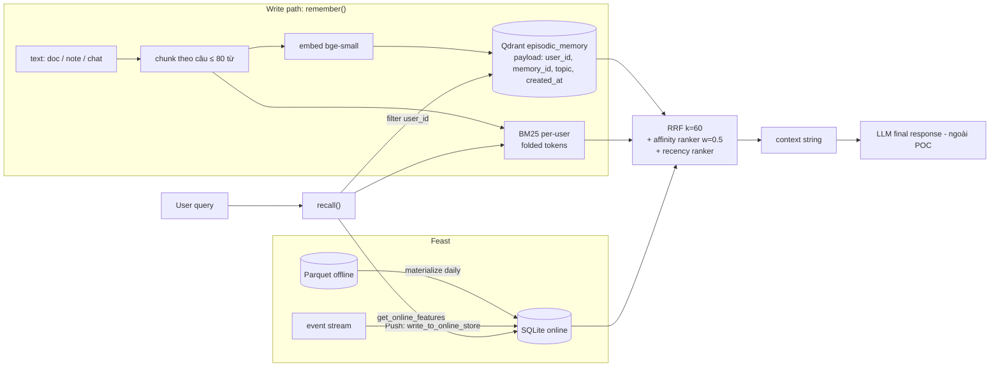

# Bonus — Hybrid Memory Agent cho trợ lý AI tiếng Việt

**Contributors:** Lâm Hoàng Phúc (solo, có dùng Claude Code làm trợ lý vibe-coding)
**Code:** [`agent.py`](agent.py) · [`demo.py`](demo.py) — chạy `python bonus/demo.py` từ thư mục gốc repo (exit 0).

## 1. Sơ đồ kiến trúc

Hai luồng đọc chạy song song: **Feast** trả lời *"user này là ai, vừa làm gì"*
(profile + recent activity, lookup < 2 ms như đo ở NB4), **Qdrant + BM25** trả lời
*"user đã từng đọc/nói gì liên quan"*. Profile vừa đi thẳng vào context, vừa điều
khiển ranking (topic_affinity → ranker thứ ba).

## 2. Ba quyết định kiến trúc

### 2.1 Chunking: theo câu, ≤ 80 từ, overlap 1 câu — *không* per-message, *không* per-conversation

| Lựa chọn | Retrieval quality | Storage | Context window |
|---|---|---|---|
| Per-message | Tốt cho chat ngắn, nhưng tin "ok, còn cái kia?" vô nghĩa khi tách khỏi ngữ cảnh | Nhiều vector nhất | Nhỏ |
| Per-conversation | Embedding bị "trung bình hoá" nhiều chủ đề → recall kém (đúng bài học NB6: một embedding cho câu hỏi ghép chỉ bắt được một vế) | Ít nhất | Một hit có thể chiếm cả nghìn token |
| **Câu-gom ≤ 80 từ** | Mỗi chunk một ý, không cắt giữa câu | Trung bình | Ước lượng được (top-3 × 80 từ) |

Chọn 80 từ vì tài liệu trong corpus dài 65–71 từ, nên một tài liệu ngắn nằm gọn
trong một chunk. Lần đầu tôi để 60 từ, tài liệu bị cắt làm hai và **cùng một tài
liệu chiếm 2/3 slot** top-3. Vì vậy tôi thêm `memory_id` và gộp kết quả theo memory
(*một slot cho mỗi memory*). Overlap 1 câu làm memory dài tốn thêm một câu cho mỗi
chunk, đổi lại không mất ngữ cảnh ở ranh giới chunk.

### 2.2 Feature schema: tabular features, tái dùng 2 view của lab

| Feature | Entity | TTL | Source | Dùng để |
|---|---|---|---|---|
| `preferred_language`, `reading_speed_wpm`, `topic_affinity` | user | 30 ngày | batch, daily | context + affinity ranker |
| `queries_last_hour`, `distinct_topics_24h` | user | 1 giờ | stream/push | "recent activity" |
| topic hay gặp trong session | user | 1 giờ (in-process) | log của chính agent | trả lời "gần đây quan tâm gì" |

**Tabular hay embedding feature?** Tôi chọn tabular vì nó **giải thích được và
debug được**. Khi Q5 ra kết quả sai, tôi đọc được ngay rằng `topic_affinity=cloud`
đang đẩy tài liệu cloud lên. Một vector "latent preference" 384 chiều sẽ che mất
nguyên nhân này. Embedding feature chỉ đáng dùng khi có đủ lịch sử để học. Với
user mới (cold start) thì một nhãn topic là đủ. TTL bám theo lab: profile 30 ngày,
velocity 1 giờ. Nếu đặt velocity TTL 30 ngày, câu hỏi "gần đây" sẽ nhận số liệu cũ.
Point-in-time join (NB4) là cách tạo dữ liệu huấn luyện cho reranker sau này mà
không rò dữ liệu tương lai.

### 2.3 Freshness strategy: ba mức cho ba use case

| Use case | Yêu cầu | Cơ chế | Lý do |
|---|---|---|---|
| "Tôi vừa đọc gì?" ngay sau khi đọc xong | **sub-second** | `remember()` upsert thẳng vào Qdrant; BM25 per-user bị invalidate và dựng lại khi cần | Nếu user không thấy memory vừa tạo thì sẽ mất niềm tin vào tính năng "nhớ" |
| Recent activity (`queries_last_hour`) | **giây** | Push API (`write_to_online_store`). Demo đẩy 11 → 14 và lần đọc kế tiếp đã thấy 14 | TTL 1 giờ: dữ liệu batch 5 phút sẽ trễ đúng lúc nó có ích nhất |
| Profile (`topic_affinity`, tốc độ đọc) | **daily** | `materialize-incremental` hằng ngày | Thay đổi chậm. Refresh theo thời gian thực chỉ tốn tiền và làm profile dao động theo từng query |

## 3. Phương án đã loại

- **Lưu episodic memory trong Feast (embedding feature view).** Tôi đã cân nhắc
  phương án này nhưng chọn tách sang vector store. Lý do: Feast tra cứu theo *khoá*
  (user_id → giá trị) chứ không tìm theo *độ tương đồng*. Chu kỳ cập nhật cũng khác
  hẳn: memory mới đến theo từng phút, còn profile thay đổi theo tuần.
- **Mỗi user một collection Qdrant.** Cách ly mạnh hơn, nhưng hàng nghìn collection
  nhỏ làm overhead của index và chi phí vận hành tăng vọt. Tôi chọn một collection
  với filter `user_id` *bắt buộc* trong mọi truy vấn. Demo kiểm tra: `u_001` hỏi
  đúng nội dung bí mật của `u_002` và không nhận được gì (`isolation check: OK`).
- **Ranker affinity luôn bật.** Phiên bản đầu bị lỗi: Q5 *"cloud security"* chỉ trả
  về tài liệu cloud vì profile lấn át ý định trong câu hỏi. Giờ ranker affinity
  (trọng số 0.5) chỉ bật khi query mơ hồ (BM25 khớp < top_k), ví dụ Q2 *"Recommend
  đọc gì tiếp"*.

## 4. Bối cảnh tiếng Việt

- **Gõ không dấu.** BM25 index trên dạng đã bỏ dấu (`fold()`: "tự động" → "tu dong",
  "đ" → "d"), nên ghi chú "hoi ve cach giam chi phi cloud" vẫn khớp với query có
  dấu. Đánh đổi: các từ đồng âm khác dấu bị gộp (ví dụ "bàn"/"bán"). Chấp nhận được,
  vì vector search vẫn phân biệt được nhờ ngữ cảnh.
- **Code-switching.** User viết "cloud security", còn tài liệu viết "bảo mật", "đám
  mây". Tôi thêm `GLOSSARY` để mở rộng query EN → VI (chỉ phía query). Nhờ đó Q5
  đưa được note về security lên top-1. Bản production nên học bảng này từ query
  log thay vì viết tay.
- **Tokenizer.** Tôi dùng whitespace/regex thay vì `pyvi`/`underthesea`. Tách từ ghép
  ("điện_toán") làm BM25 chính xác hơn, nhưng tăng latency, thêm dependency và
  hỏng với văn bản không dấu. Với memory cá nhân ngắn, tách theo âm tiết + bỏ dấu
  là đủ cho POC. Vector search bù lại phần nghĩa của từ ghép mà BM25 bỏ lỡ.
- **Embedding.** `bge-small-en` yếu với tiếng Việt diễn đạt lại (NB2: 24% trên
  paraphrase). Production nên dùng `bge-m3`, đổi qua `EMBEDDING_BACKEND` và phải
  index lại.
- **Nghị định 13/2023 (bảo vệ dữ liệu cá nhân).** Memory là dữ liệu cá nhân, nên
  cần sự đồng ý của user, quyền xoá ("quên tôi đi"), và lưu trữ trong nước nếu dữ
  liệu nhạy cảm.

## 5. Những gì POC chưa xử lý

- Chưa có CRUD: không xoá hay sửa memory, nên chưa đáp ứng quyền xoá theo NĐ 13.
- Qdrant và BM25 nằm trong RAM: restart là mất hết. Chưa mã hoá at-rest, chưa đồng
  bộ nhiều thiết bị.
- Chưa có memory decay hay consolidation: memory cũ tồn tại mãi.
- Truy vấn "gần đây" vẫn trả tài liệu cũ hơn ghi chú mới nhất. Ranker recency chỉ
  có trọng số 1 trên 3 ranker, nên trong demo Q3 trả lời chủ yếu bằng `[recent]`/
  `[session]` từ Feast chứ chưa bằng chính memory.
- Q1 có 2/3 kết quả đúng (top-1 và top-3 nhắc Kubernetes), top-2 là kết quả nhiễu.
- Chưa có golden set cho memory, nên chưa đo được Precision@k như NB2. Các nhận xét
  ở trên dựa trên việc đọc output.

## 6. Ghi chú vibe-coding

**Prompt hiệu quả:** *"Viết `remember/recall` theo đúng pattern RRF trong
`app/search.py`, rank 1-based, filter `user_id` bắt buộc"*. Đưa sẵn file mẫu nên
code khớp với lab ngay lần đầu. **Prompt thất bại:** để AI tự thêm ranker
personalisation mà không chỉ rõ khi nào được bật. Kết quả là ranker luôn bật và
Q5 sai. Chỉ khi đọc output, tôi mới thấy profile đang lấn át query. Đây là một
quyết định thiết kế, không phải boilerplate.
